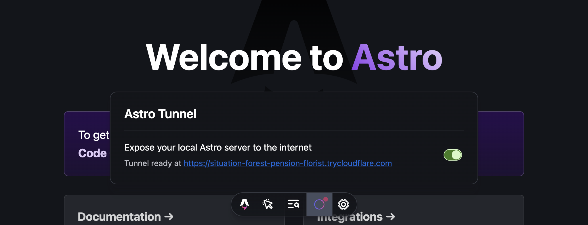

# Astro Tunnel



Astro Tunnel is an [Astro Dev Toolbar App](https://docs.astro.build/en/reference/dev-toolbar-app-reference/) that enables your local Astro server to be accessible from the internet. Internally, it uses Cloudflare's [Quick Tunnels](https://developers.cloudflare.com/cloudflare-one/connections/connect-networks/do-more-with-tunnels/trycloudflare/) via [unjs/untun](https://github.com/unjs/untun), so no additional configuration is required to start tunneling.

## Installation

To install Astro Tunnel, run the following command with your preferred package manager:

```sh
npx astro add astro-tunnel
```

## Usage

```ts
import { defineConfig } from 'astro/config';

import tunnel from 'astro-tunnel';

export default defineConfig({
  integrations: [tunnel()],
});
```

Upon first starting a tunnel, you will be prompted to accept the terms of the Cloudflare License, Terms and Privacy Policy on the command line. Once you accept these terms, a tunnel will be initiated and a public URL for your local Astro server will be displayed inside the Dev Toolbar.

If you encounter any issues while starting a tunnel, try installing `cloudflared` separately by running `npx untun@latest tunnel http://localhost:3000` first. After that, you should be able to start a tunnel from within the App.

## Configuration

Astro Tunnel accepts the following options:

```ts
tunnel({
  // The URL to expose. Defaults to http://localhost:4321.
  url: 'http://localhost:4321',
  // The local server port to expose. Defaults to 4321. Only used if `url` is not set.
  port: 4321,
  // The local server hostname to expose. Defaults to localhost. Only used if `url` is not set.
  host: 'localhost',
  // The local server protocol to use. Defaults to http. Only used if `url` is not set.
  protocol: 'http',
  // Whether to verify the local server TLS certificate. Defaults to false.
  verifyTLS: false,
  // Whether to accept the Cloudflare terms of service. Defaults to false.
  acceptCloudflareNotice: false,
});
```
